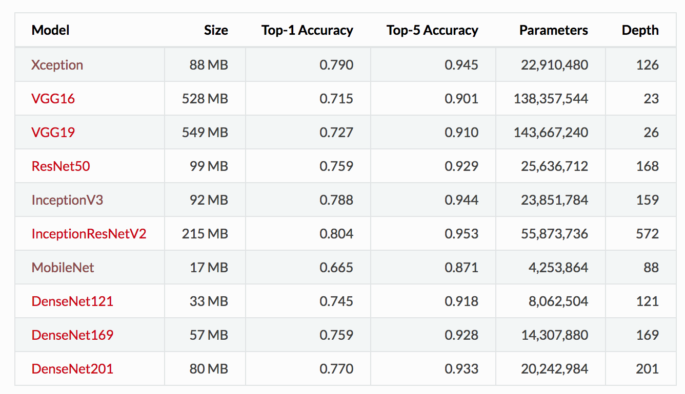

# Transfer Learning on Inception V3

I was curious what types of CNN people generally use for application. Some search indicates that [Keras](https://keras.io/applications/#inceptionv3) provides some most common award-winning CNN models like below



I mainly this [tutorail](https://deeplearningsandbox.com/how-to-use-transfer-learning-and-fine-tuning-in-keras-and-tensorflow-to-build-an-image-recognition-94b0b02444f2). In fact, a lot of code samples on [Keras official website](https://keras.io/applications/#inceptionv3) as well.

The code in image_recognition contains produces top 3 ImageNet labels of some existing model. I changed the code so that we can recognize several images at the same time.

If the thing you want to recognize is in the 1000 ImageNet labels, then no need to train the new model. However, often people may want to do finer-grain recognition, like flower for example, then you will want to do transfer learning.

In this case, I tried with this [flower dataset](https://www.kaggle.com/alxmamaev/flowers-recognition) with around 4000 images of 5 different flower types.

Let's see how transfer learning plays a big role here.

If we pass in 5 test images (one flower each type) directly to Inception V3, we get 

```
test_dir/daisy.jpg
[(u'n11939491', u'daisy', 0.9223016), (u'n02206856', u'bee', 0.0037925253), (u'n02190166', u'fly', 0.0026056098)]

test_dir/sunflower.jpg
[(u'n11879895', u'rapeseed', 0.85600924), (u'n03457902', u'greenhouse', 0.0196783), (u'n11939491', u'daisy', 0.006578349)]

test_dir/rose.jpg
[(u'n03065424', u'coil', 0.6355542), (u'n07718747', u'artichoke', 0.075762965), (u'n04525038', u'velvet', 0.035608593)]

test_dir/tulip.jpg
[(u'n03457902', u'greenhouse', 0.04418846), (u'n03930313', u'picket_fence', 0.03686282), (u'n11939491', u'daisy', 0.035175655)]

test_dir/dandelion.jpg
[(u'n02206856', u'bee', 0.7928109), (u'n11939491', u'daisy', 0.0660278), (u'n02190166', u'fly', 0.045882557)]
```

As we can see, ImageNet don't have many flower labels, so it doesn't recognize most of the images we passed in except daisy.

With transfer learning (without fine-tuning), we see that

```
Epoch 1/3
122/122 [==============================] - 870s 7s/step - loss: 8.3408 - acc: 0.3186 - val_loss: 1.2477 - val_acc: 0.5422
Epoch 2/3
122/122 [==============================] - 837s 7s/step - loss: 0.8703 - acc: 0.6803 - val_loss: 2.0467 - val_acc: 0.4361
Epoch 3/3
122/122 [==============================] - 855s 7s/step - loss: 0.6697 - acc: 0.7574 - val_loss: 2.0573 - val_acc: 0.4578
```

When we test on the 5 images on the new model that predicts only one of the 5 labels, we got

```
Using TensorFlow backend.
file: test_dir/daisy.jpg
prediction: daisy with probability 0.99999976

file: test_dir/sunflower.jpg
prediction: daisy with probability 0.63570243

file: test_dir/rose.jpg
prediction: rose with probability 0.6361567

file: test_dir/tulip.jpg
prediction: tulip with probability 0.9682995

file: test_dir/dandelion.jpg
prediction: sunflower with probability 0.509505
```

As we can see, the validation set has only accuracy 0.4578, still has a lot of improvement space. A few things I can still try in the future:

* The training accuracy (0.7574) much higher than lower accurcy (0.4578), meaning there might be an overfitting issue. So more data could help. In particular, daisy and tulip seems to be doing pretty well, so more data of rose, sunflower especially dandelion could help.
* I didn't do "fine-tuning" part (only transfer learning part) due to time limit. Fine-tuning changes weights of previous layers too while transfer-learning only chanegs the last layer. I should try running the training on Google Cloud or AWS.
* Perhaps more epoches? Since the cost seems to still go down after 3 epoches.
